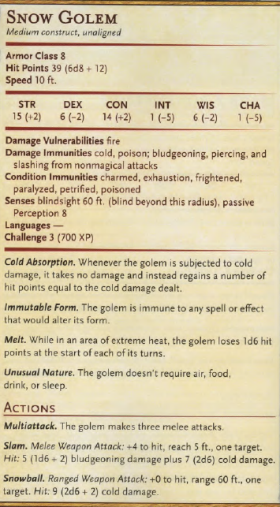
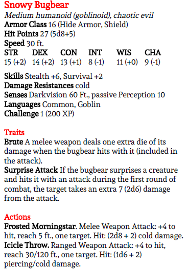

## **0. Introduction**
**[Ambience, Winter Wind](https://youtu.be/1WY15_9xhcg?t=0)**

**Read-Aloud Text:**
- *"The village of **Fishslap Harbor** nestles against the icy expanse of the frozen **Lake Silverscale**--its modest buildings blanketed by thick layers of snow. The air is crisp and still--broken only by the occasional creak of ice shifting and scraping in the harbor. Snow falls softly, its flakes drifting lazily in the dim twilight; coating the cobblestone streets and muffling every sound."*

- **[Music, Christmas in Skyrim](https://youtu.be/_qgKdOlAH8w?t=0)**
- *"At the heart of the village, the windows of the **Blushing Reindeer Inn** glow like a sunset, an inviting refuge from the winter's chill. Inside, you sit around a large dining table near the central hearth where hearty meats sizzle over the flames. The rich scents of spiced cider and roasting venison fill the air, warmly blending with the radiating heat of the crackling fireplace. The flames cast long, flickering shadows across the rough-hewn wooden beams, adding to the inn's rustic charm. Laughter and the clink of mugs echo softly, a soothing counterpoint to the biting silence outside. For now, the cares of the world seem distant, and the inn's cozy embrace shields you from the harsh grasp of winter."*
- *"The tavern door creaks open, letting in a gust of frosty air and a flurry of snowflakes as a band of **five Kringle Elves** steps inside. At their head stands what appears to be a little girl, her rosy cheeks and determined expression framed by a thick, fur-lined white hood. The barmaid looks up from her work and calls out warmly,* "Oi, **Siff**! Take a load off an' warm yerself by the fire. I'll get yer lot some spiced cider an' a bit o' roasted pheasant stew in a tick."
- *"A small crowd of villagers gathers near the fire, their laughter and stories rising above the clink of mugs. Among them now stands the group of Kringle Elves, their colorful winter gear and pointed hats setting them apart. **Siff**, their leader, steps forward--a small figure with piercing eyes and a presence that belies her size. Her companions, though cheerful, glance nervously at each other. One however, stares blankly into the flames, his hands trembling slightly."*
- *Siff glances around the room, her sharp eyes scanning the faces all around you. When her gaze lands on your corner table, one by a large, floor-to-ceiling window with a view of the village, she pauses. After a moment of intent observation, she motions for her companions to follow and strides purposefully toward you."*

### **0.1 Key NPCs:**
- **Siff**
  - A mature Kringle Elf who appears as a child. She leads a group of loyal elves and seeks the party's aid in rescuing Santa and the Workshop.
- **Her Crew**
  - **Thrinn**: Stoic but shaken by the events.
  - **Brok, Kari, and Miles**: Each eager to assist but clearly outmatched by the challenges ahead.

### **0.2 Opening Dialogue: Setting the Stage**
- **Siff's Opening Lines:**
   - *"Oh, beggin' your pardon, but you might just be exactly who we've been looking for! And let me tell you, we've been looking high and low--and we're not known for keeping quiet about it, either!"*
   - *"You don't look like the sort from 'round these parts. Adventurers, are you? We've heard tales of your lot passing through Fishslap Harbor. Tell me, are you the kind that knows how to handle a bit of trouble--or a whole heap of it?"*
- **Building Trust:**
   - *"Now, don't mind me being blunt, but my crew and I've come a long way to find help, and we're fresh out of time for bein' picky. We just need someone who still believes in the spirit of Christmas--because right now, it's hangin' by a thread!"*

**Read-Aloud Text**
- *"The warmth of the inn is at odds with the tension hanging in the air. Though the elves try to maintain a cheerful demeanor, their glances betray their worry."*
- **Thrinn's Condition:**
  - *"Thrinn sits near the hearth, his face pale and his hands trembling. He stares into the flames, his breath uneven, seemingly lost in a memory too painful to recount."*
  - A **DC 10 Persuasion** check gets him to recount his fragmented escape:
    - *"It was chaos… **Frost Goblins** everywhere… **Ice Sprites**--buzzing and laughing… **Snowy Bugbears** smashing everything in sight…"*
  - His broken words trail off as the other elves exchange uneasy glances.

- **The Elves' Call to Action**
  - **M**: *"It's **Santa** and **Carol Claus**, you see!"* **Miles** chimes in, eyes wide. *"They're gone--vanished like snow in spring!"*
  - **B**: *"Taken, they were! And the whole **Workshop**'s crawling with monsters now--vicious things, all claws and teeth. We need someone who's not afraid to put things right again. What do you say?"* says **Brok**.
  - **K**: *""If we don't move quick, **Christmas** won't just be canceled--it'll unravel! The magic that keeps the **North Pole** ticking will be gone, just like that!"* says **Kari**.
  - **S**: *"Look, Santa's no warrior--never was. He's joy and kindness wrapped in a red coat. He needs someone with the strength to shield his magic, and, well… we tried, but we're no match for what's up there."* **Siff** pauses, leaning in with a hopeful glint. *"What about you? **Can you help us?**"*

### **0.3 Siff's Final Pitch**
   - *"I'll be honest with ye--our pockets aren't exactly a-jinglin' with gold. But what we do offer, well… it's worth far more than coin. You'll earn lifetime membership on **Santa's Nice List**--aye, no matter what mischief you find yerselves in later."*
   - *"And, as a cherry atop the snowdrift, you'll each receive one gift pulled from **Santa's Holiday Bag of Holding**. Who knows? Might be a magical trinket, might be a pair o' socks that never wear out. Either way, it'll be somethin' special, straight from the big man himself. So… what say ye?"*

---

## **1. Arriving at the North Pole**
**[Ambience, Winter Wind](https://youtu.be/1WY15_9xhcg?t=0)**

**[Ambience, Dog-Pulled Sleigh](https://youtu.be/YUcZfH2YYN8?t=0)**

**Read-Aloud Text:**
- *"The elves escort you all in their **sleigh**, pulled by **four reindeer**, back to the **North Pole**. Time seems to dilate as the sleigh soars over snow-laden plains, gliding effortlessly across the icy expanse. The frosty wind nips at your faces, but the sight of the auroras dancing across the midnight sky fills you with awe. The faint twinkle of distant lights, marking the North Pole, grows brighter as you approach."*
  - **Reindeer Names**: Pinecone, Silver, Jingle, and Snowdash
- *"Suddenly, an eerie roar cuts through the stillness, sending a shiver down your spine. A shadow streaks across the moonlit snow below."*

### **1.1 Encounter: Snow Golems**
**[Music, The Elder Scrolls V: Sovngarde](https://youtu.be/h1PalyWp5zY?t=0)**

- **Description:**
  - *"**Two Snow Golems** emerge from the frosty shadows, their massive forms looming like icy sentinels brought to life. With a grinding rumble, they lift jagged chunks of ice and hurl them toward the sleigh, the frigid projectiles whistling through the air like winter's wrath unleashed. Roll initiative."*

- **Mechanics:**
  - The Snow Golems aim to **disable the sleigh**, but quick action from the party can neutralize the threat.
  - **If the sleigh is damaged:**
    - A **DC 10 Survival** check can provide a makeshift fix.
  - The battle is set against the backdrop of the sleigh's rapid flight, offering opportunities for creative combat.

- **Useful Monster Parts**
    - Defeating the golems yields **x8 Snow Golem Teeth**--effectively permanent ice cubes.

---

**Snow Golem Teeth**

*Wondrous Item, Common*

**Description:**
- *"These icy, jagged teeth, harvested from the frozen maw of a Snow Golem, are cold to the touch and perpetually maintain a temperature of 32 degrees Fahrenheit. Each tooth is semi-translucent, faintly glowing with an inner frost."*

**Properties:**
  - **Perpetual Cold:** These teeth can be used as a source of cold, perfect for chilling drinks or preserving perishable items.

---

## **2. Exploring the North Pole Village**
**[Music & Ambience, Snowed in at Rito Village](https://youtu.be/ZgA2PUq4-OY?t=60)**

**Read-Aloud Text:**
- *"You arrive at the **North Pole** as the sleigh lands gently in the center of a round courtyard. The village looks like something out of a storybook--candy-colored cobblestone streets twist between gingerbread-like buildings with a thick frosting of snow on their roofs. Bright, festive lights twinkle merrily in every direction, casting a warm glow across the scene."*
- *"The faint sound of cheerful music lingers in the air, but it feels hollow, almost distant, as though something has stolen the true joy from the place. Towering over the village is the **Workshop** itself, its iconic silhouette unmistakable, but smoke rises from its chimney--not the comforting plume of a bustling factory, but something darker..."*
- **Investigating the Buildings**
  - Most buildings are locked and eerily quiet. If the party knocks on any doors, they hear muffled voices, whimpers, or even a scream.
  - If someone answers, they reveal themselves to be frightened **Kringle Elves** who thank the adventurers for their bravery before quickly retreating back inside.

- **Holiday Gifts Scattered Around Town**
  - These presents, remnants of the Workshop's production line, offer surprises for the adventurers.
  - **Read-Aloud Text:**
     - *"As you wander the snow-covered streets, you notice brightly wrapped gifts littering the ground. Each package is adorned with festive paper and cheerful bows, their colors stark against the white snow. They seem almost out of place amidst the destruction, as though stubborn reminders of the joy this place once embodied. The gifts beckon with the promise of surprise."*
  - **Finding the Gifts:**
    - Place **1–3 gifts** in each major area or after encounters, depending on pacing and loot balance.
    - Players must **physically interact** with the gifts to open them.

- **Open Gifts with the Following Table:**

| Roll (d20) | Gift Contents                         |
|------------|---------------------------------------|
| 1          | **Mimic Gift:** A festive Mimic disguised as a present attacks! Upon defeat, it drops **1 lump of coal.** |
| 2–10       | **Common Treasure:** The gift contains either **1gp** worth of spellcasting material or a **1gp coin.** |
| 11–16      | **Frosted Snowman Cookie:** A delicious cookie that acts as a **Potion of Healing** (restores 2d4+2 HP). |
| 17–19      | **Fruit Cake of Greater Healing:** This dense fruit cake restores **4d4+4 HP** when consumed. |
| 20         | **Magical Treasure:** The gift contains a **Rudolph's Nose of Everlasting Light** from Appendix B. Emits 30ft red light when worn on nose.|

---

### **2.1 Optional Encounter: Mimic**
- **[Music, Zant Battle](https://youtu.be/fp3r5HodpTE?t=0)**

---

## **3. Santa's Workshop**

### **3.0 Approaching the Workshop**
- **[Ambience, Crunching Snow](https://youtu.be/a_oqcg0hvpo?t=4)**
- **[Ambience, Winter Winds](https://youtu.be/1WY15_9xhcg?t=0)**

**Read-Aloud Text:**
- *"As you approach the **Workshop**, a sense of unease deepens. The building itself is much smaller than it looks from far off, its red and yellow exterior painted to resemble a giant present complete with ribbon-like trim. One of the two large wooden doors hangs off its hinges, creaking faintly in the icy breeze. Beyond the doorway, you can feel the faint warmth of a fire but see only shadows dancing within. The snow crunches underfoot as you approach the entrance, the silence broken only by the occasional snap of a falling icicle."*

---

### **3.1 The Lobby**
**[Ambience, Cozy Fireplace and Winter Storm](https://youtu.be/yJjZfrx1nog?t=0)**

**[Ambience, Cozy Fireplace and Winter Storm](https://youtu.be/yJjZfrx1nog?t=0)**

**Read-Aloud Text:**
- *"The room feels more like a cozy cabin than part of a workshop. Dark wooden floorboards creak beneath your boots, and festive wallpaper, bordered in red and green, lines the walls. Artifacts from many cultures--delicate ornaments, carvings, and illustrations--are proudly displayed, giving the space a sense of unity and joy. A roaring fireplace nestled into the curved wall casts a warm, flickering glow, its flames crackling cheerfully, defying the dark and somber night beyond. The faint sounds of **Christmas music** echo throughout the halls. An open doorway across the room leads deeper into the workshop."*

---

### **3.2 Common Area**
**Read-Aloud Text:**
- *"You step into a room that was once a warm and lively gathering place. Now, chairs, benches, and tables lie scattered and broken, their jagged edges jutting out--reminders of the chaos that unfolded here. The floor is littered with fragments of wood and torn decorations. Amid the wreckage, a pile of unwrapped presents sits atop a long table, their bright paper torn, singed, or charred. What might have been a joyful scene of gift-giving is now a grim tableau of destruction."*
- *"These gifts weren't opened with eager hands or laughter--they were torn apart in malice. Their contents have been reduced to ashes and scorched fragments, while small fires smolder faintly in the corners of the room. The air carries the acrid scent of burned paper and melted ribbons, a sharp contrast to the faint, lingering smell of peppermint and holiday spices."*

---

### **3.3 Large Common Area**
**Read-Aloud Text:**
- *"Beyond the initial room, the space opens into a larger common area, its high ceilings and sprawling layout hinting at the joy it once held. The remnants of colorful garlands hang limply from the walls, singed at the edges, while broken decorations litter the floor. At the far corner, a massive **holiday tree** lies toppled on its side, its branches engulfed in **flames**. Ornaments dangle precariously from its smoldering boughs, dropping occasionally with faint tinkling sounds as they shatter on the ground."*
- *"Behind the burning tree, in the farthest corner of the room, a small group of **Kringle Elves** huddle together, their faces pale with fear. They flinch at every sound, clutching one another tightly as their wide eyes dart toward the destruction around them."*
- *"To the rear of the room, a staircase leads downward into shadow. Once brightly lit, it now plunges into a dark, foreboding mystery. Above the stairs, a sign crafted from candy canes hangs askew, its painted letters spelling out **'To the Workshop Floor.'**."*
- **If the players help the Kringle Elves:**
  - Each party member receives **1 Holiday Gift** as a reward.
    - **No mimic** may appear for this gift.

---

### **3.3.a. Sprites on the Stairs**

**Read-Aloud Text:**
- *"As you begin your descent, the creaking stairs echo beneath your feet, each sound amplified by the stillness of the air. A chill seeps into the passageway, the temperature dropping with every step. Suddenly, the silence is shattered by a cacophony of high-pitched laughter and the rapid buzz of tiny wings. From above, a swarm of shimmering Ice Sprites swoops down, their translucent forms glowing faintly like shards of frost."*
  - **[Music, You woke up as a cat (playlist)](https://youtu.be/hnAq7CB_ito?t=0)**
- *"The sprites circle chaotically, their movements erratic and unpredictable. Their glowing eyes glint with mischievous glee as they screech and giggle, their voices chiming like shattered icicles. One sprite zips forward, squealing*, 'You'll never make it! Turn back while you can!' *before dissolving into another fit of raucous laughter. They dart in and out of the shadows, taunting and jeering, but make no move to attack."*

**Actions and Outcomes**
  - **If the party chooses to attack the ice sprites:**
    - They retreat quickly into the darkness, their laughter echoing as they disappear.
    - The sprites are small, nimble, and evasive, darting out of reach as the players attempt to strike.
    - The party succeeds in driving the sprites away, but gains **no information**.
- **If the party engages the sprites in conversation:**
  - Players may roll a **Charisma (Persuasion or Intimidation)** check to interact with the sprites.
  - The sprites **mock** the party, **giggling** and **warning** them about the **dangers** ahead:
  - **DC 10–14:**
      - *"You'll never save **Santa** in time! He's as good as gone!"*
  - **DC 15–19:**
    - *"**Eldara**'s been soooo clever with Santa and Carol! The Workshop is toast, and you'll never stop her!"*
  - **DC 20+:**
    - *"Oh, you poor fools! Eldara's going to be the Christmas Witch! She's already taking Santa's magic--it's hers now! You're too late!"*
- **Regardless of the Outcome:**
  - After interacting with the party, the sprites burst into **mocking laughter**:
    - *"We've delayed you long enough! **Santa**'s doomed!"*

---

### **3.4 Kitchen**
**[Ambience, Cozy Kitchen](https://youtu.be/SQxVJLI9zRE?t=0)**

**Read-Aloud Text:**
- *"The kitchen is a sugary disaster. **Flour** coats every surface like a fine layer of snow, while **candy cane shards** crunch underfoot. Half-melted gummy gumdrops stick stubbornly to walls, shelves, and countertops, creating **sticky trails** wherever they cling. The air is rich with the scent of chocolate and burnt sugar, accented by the faint, bitter tang of scorched marshmallows. Amidst the mess, the kettle on a dented cookstove emits a soft burble, as a few Kringle Elves attempt to have tea as quietly as possible."*
- The elves are named **Junius** and **Bibius**.
  - They are basically Merry and Pippin from Lord of the rings.
- **Junius and Bibius Dialogue**
  - **J:** *"Oh, us? Just trying to salvage what's left of the good stuff, of course! Can't let all this sugar go to waste, now can we?"*
  - **B:** *"We figured, if the world's falling apart, might as well have a proper cup o' tea while we wait!"*
  - **J:** *"Besides, someone's gotta keep the spirits up, aye? Might as well be us!"*
  - **B:** *"We tried helpin' in the Workshop, but… well… turns out we're not exactly fighter material."*
  - **J:** *"We ran when the Frost Goblins showed up! Just legged it, kettle and all."*
  - **B:** *"Well, we were thinking--if we're doomed anyway, why not enjoy a spot of marshmallow tea before the end?"*
  - **J:** *"Junius said it was a terrible idea, but here we are, enjoying it splendidly!"*
  - **B:** *"You wouldn't believe how good burnt sugar smells when you're too scared to think about it!"*
  - **J:** *"Oh, the Workshop's a right mess. Goblins everywhere, and those awful Ice Sprites! Thought they'd tear the place apart."*

---

### **3.5 Candy Storage**

**[Ambience, Cozy Fireplace and Winter Storm](https://youtu.be/yJjZfrx1nog?t=0)**

**[Music, Cozy Christmas with Snow and Writing Sounds](https://youtu.be/K6W8Amgi3ek?t=0)**

**Read-Aloud Text**
- *"The storage room is a scene of saccharine chaos. Flour dusts every surface, hanging faintly in the air with each step. Candy cane shards crunch underfoot, while unknown sticky streaks coat the walls and ceiling. Burlap bags lie ripped open, spilling heaps of unknown powders into careless piles. On a high shelf, a lone cupcake remains untouched, its frosting perfectly swirled, standing out like a proud sentinel clad in white armor."*

**Actions and Outcomes**
- **If a player inspects or takes the cupcake:**
  - *"The cupcake is pristine and smells impossibly sweet."*
  - Eating the cupcake takes 1 action and restores **2d4+2 HP**, functioning as a **Potion of Healing**.
- **If the players investigate the locked door:**
  - *"The door leading outside is sturdy and locked tight."*
    - **DC 15 Dexterity (Thieves' Tools)**: picks the lock.
    - **DC 17 Strength**: forces the door open.
- **If the players open the door:**
  - The door reveals a narrow path leading to a small **Extra Storage Shed** attached to the building.

---

### **3.6 Extra Storage**
**[Ambience, Winter Wind](https://youtu.be/1WY15_9xhcg?t=0)**

**Read-Aloud Text**
- *"The smashed door hangs crookedly on its hinges, barely clinging to the frame as the scent of burning sugar and scorched wood still clings to the wind."*
- *"Inside, the room is a whirlwind of destruction. **Three Frost Goblins** shriek with glee as they rampage through the space, their jagged, frost-rimmed weapons smashing jars and overturning shelves."*
- *"**Icy blue flames** crackle unnaturally where they've set small fires, their cold light casting eerie, shifting shadows on the walls."*

**Actions and Outcomes**
- **If the party engages the Frost Goblins:**
  - **[Music, BattleBlock Theater](https://youtu.be/Y0u9Hs5fgzE?t=0)**
  - The Frost Goblins are **hostile** and immediately attack to protect their mischief and destruction.

- **After defeating or driving off the goblins:**
  - Among the rubble, a successful **DC 12 Investigation (Intelligence)** or **DC 14 Perception (Wisdom)** check reveals **Kringle's Favorite Candy Cane** buried beneath a pile of smashed jars.

---

**Kringle's Favorite Candy Cane**

*Magic Item, Common*

**Description:**
- *"If you've ever seen a more perfect candy cane, you can't think of it. The plastic comes off without breaking the cane, the stripes are perfectly even, and the pepperminty taste is beyond perfection."*

**Properties:**
- **Arcane Focus:** Can be used as an arcane focus for spellcasting.
- **Frosty Power:** Adds **+1 Cold Damage** to all **spell damage rolls**. This effect does not stack with additional effects that increase Cold Damage.
- **Sweet Refreshment:** Once per day, you can suck the candy cane for **6 seconds** (equivalent to a round of combat) to restore 1d4 HP. This ability resets after a long rest. The candy cane disappears after 100 uses.

---

## **4. The Workshop Lower Levels**

**[Ambience, Snowfall with Crackling Fireplace](https://youtu.be/XFidh8FLE40?t=0)**

**[Music, I must rest here a moment](https://youtu.be/IXsWr2CK4SI?t=0)**

### **4.1 Entrance Corridor *(Accessed via 3. Large Common Area)***
**Read-Aloud Text**
- *"The stairs end abruptly, depositing you into a dimly lit room where the air feels heavier, thick with dust and a palpable sense of unease. Before you stand two massive wooden doors, their splintered remains blown off their hinges as if some unimaginable force tore them apart. Fragments of wood and metal litter the floor, evidence of violent entry."*
- **When the players peek through the doors:**
  - *"Beyond the ruined doors stretches a long hallway, shrouded in a faint, otherworldly glow. The only light comes from lit torch sconces lining the halls, their faint flickers sporadically cutting through the shadows. With each burst of light, jagged silhouettes dance across the floor, their movements sharp and unnatural. The faint hum of magic lingers in the air, giving the hallway an oppressive aura, as if the space itself resists your intrusion."*

---

### **4.2 Foyer**
**Read-Aloud Text**
- *"You step into a small entryway, the air carrying the same uneasy stillness as the room outside. One door hangs precariously off its hinges, leaning against the frame. The chamber beyond looms in the faint glow, its details obscured in half-light."*

---

### **4.3 Toymaking Workshop Floor**
**Read-Aloud Text**
- *"You step into a massive, round chamber, its ceilings stretching impossibly high into the shadows above. This is clearly the factory floor, where toys were once lovingly crafted by the diligent hands of Kringle Elves. At another time, this space would have been alive with laughter, the hum of tools, and the rhythmic clatter of assembly lines. Now, it lies eerily silent and ransacked, the echoes of its joyful past swallowed by the surrounding destruction."*
- *"The candy-colored cobblestone floor glimmers faintly beneath your feet, interrupted by a gigantic clock embedded in the center, its hands moving with a magical precision. Overturned tables and broken stools are scattered like the remains of a battlefield, their splinters mingling with shattered decorations and debris. Broken toys--dolls, stuffed animals, and figures--are flung across the room, their torn and battered forms unsettlingly reminiscent of lifeless bodies."*
- *"Amidst the wreckage, a giant **Holiday Tree** towers in the center of the room, its ornaments sparkling in the dim light. Strangely, it stands untouched by the devastation, its vibrant decorations undisturbed by the chaos around it."*
- *"In the very center of the room, atop the clock's face, a group of creatures revels in their destruction: three **Frost Goblins**, **two Winged Kobolds**, and a hulking **Snowy Bugbear**. They laugh with malicious glee, smashing what little remains intact, completely oblivious to your presence."*

**Actions and Outcomes**
- **Investigating the Clock:**
   - A **DC 12 Perception (Wisdom)** check reveals that the clock is not merely decorative.
   - The players discover it is a **countdown timer**, marking the time left until the delivery of toys. The clock's hands move with magical precision, its ticking a faint but ominous reminder of the stakes.
- **Approaching the Holiday Tree:**
   - The tree is a **Mimic in disguise**.

   - Players must roll **Passive Perception** against the **Mimic's Stealth check** to detect its nature.
     - **[Music, When you've realized you've made a terrible mistake](https://youtu.be/ggt9Lz6FzLg?t=0)**
     - **Failed Check:** The Mimic surprises the party, lashing out with garland and lights to Grapple **1d3 players** upon physical contact.
     - **Successful Check:** The players notice the tree's unnaturally subtle movements, allowing them to approach cautiously or avoid it altogether.
- **Engaging the Monsters in the Clock's Center:**
   - The **Frost Goblins**, **Winged Kobolds**, and **Snowy Bugbear** immediately stop their destruction and focus on attacking the party.
   - **Enemy Composition:**
     - **3 Frost Goblins**
     - **2 Winged Kobolds**
     - **1 Snowy Bugbear**

**Combat Dynamics**
- **If the Mimic Has Not Been Engaged:**
   - The monsters fight **defensively**, attempting to distract the party and draw them toward the Mimic.
   - The Snowy Bugbear may position itself to **block the players' approach** while the Kobolds and Goblins harass from range.
- **If the Mimic Has Been Engaged:**
   - The monsters fight with **pure aggression**, coordinating attacks to deal as much damage as possible.
   - The Snowy Bugbear charges into melee, while the Kobolds use their flight to flank the party.
- **Environment Hazards:**
  - The scattered debris and overturned furniture can create terrain challenges. Treat some areas as **difficult terrain** to add tactical depth.
  - The clock's magical energy could spark erratically during combat, potentially dealing minor damage (1d4 force) to anyone standing too close.
- **Reward for Victory:**
  - If the party successfully defeats the Mimic and monsters, they may further investigate the clock or find minor loot in the debris, such as a small pouch of **Butterbill's Boot Tobacco Shake** or **1-3 Holiday Gifts**.

---

**Bag of Butternugs' Boot**

*Magic Item, Common*

**Description:**
- **The bag's label reads:** *"Fiending for something? Poor and dirty? Want something to do to waste the day away and give yourself a repugnant smell? Try this boot pipeweed shake. It tastes like boot. You'll also probably get cold as your circulation wanes, causing you to feel the bite of the wind just a little bit more. That's it. We are not liable if this product burns your lungs or you lose friends from the smell that will cling to your clothes. Maybe if you get a job you'll be able to afford something better, but until then, at least you have this boot shake."*

**Properties**
- This pipeweed shake is distributed **Randy Butternugs**, a trader and wholesaler in Baldur's Gate who runs several pipeweed farms out of Goldenfields.
- Each bag contains enough for **20 smoke sessions**, and after smoking, the smoker rolls a **d20**.
- An even number grants a **+1 bonus** to **Perception** checks for **1 hour**.

---

### **4.4 Toy Storage**

**[Ambience, Snowfall with Crackling Fireplace](https://youtu.be/XFidh8FLE40?t=0)**

**[Music, I must rest here a moment](https://youtu.be/IXsWr2CK4SI?t=0)**

**Read-Aloud Text**
- *"This room is a chaotic scene of fear and mischief. In the far corner, a group of Kringle Elves huddles together, their small forms trembling as their wide eyes dart about in panic. Above them, **four Frosty-Winged Kobolds** circle like vultures, their translucent wings shimmering as they beat the air with an unsettling rhythm. Their shrill laughter echoes through the space as they taunt the elves, occasionally diving low to send icy chills skittering across the ground."*
- *"Around the corner, the sound of giggling hints at another source of chaos. **Two Ice Sprites** hide in the shadows, their tiny forms barely visible as they gleefully rip open boxes and bags of toys. With wicked precision, they fling the contents toward the huddled elves, adding to the mess of broken trinkets and shredded wrappings that litter the icy floor. Frost glimmers faintly on every surface, and the bitter chill in the air makes each breath hang visibly before you."*

**Actions and Outcomes**
- **If the party engages the Frosty-Winged Kobolds and Ice Sprites in combat:**
  - **[Music, You are a spy who is about to be exposed](https://youtu.be/khRJMiquAjA?t=688)**
  - **Frosty-Winged Kobolds:**
    - The Kobolds use their flight advantage, harassing the party from the air.
    - They employ their **icy breath** and **frost claws** to slow and damage adventurers, focusing on keeping their distance.
  - **Ice Sprites:**
    - Initially hidden, the Sprites attack from cover with thrown projectiles (toys) until discovered or provoked.
    - Once discovered, they attempt to use their agility to evade direct combat.
- **If the party attempts to negotiate or intimidate the mephits and sprites:**
   - A **DC 15 Charisma (Persuasion or Intimidation)** check convinces the creatures to leave.
     - **Success:** The monsters fly off into the shadows with mocking laughter.
     - **Failure:** The creatures double down on their torment, taunting the party with cruel jibes before attacking.
- **If the party rescues the Kringle Elves:**
     - Once the threat is eliminated, the Kringle Elves profusely thank the adventurers.
- **If the party searches the area:**
  - Among the discarded toys, a successful **DC 12 Investigation (Intelligence)** check uncovers **1-3 Holiday Gifts**.

---

### **4.5. Jack's Locked Chamber**

**[Ambience, Ominous Tension Building](https://looptube.io/?videoId=xAO3x-Uhfoo)**

**Read-Aloud Text**
- *"Behind the locked door lies a room steeped in an **eerie stillness**. The air feels heavy, yet untouched by the destruction that plagues the rest of the Workshop. The space is **unnervingly bare**--no debris, no scorch marks, no sign of the chaos outside. At its center sits a single **Jack-in-the-Box**, its surface painted in festive reds and greens, trimmed with delicate gold filigree that gleams faintly in the dim light. The box looks pristine, its crank positioned invitingly, as though waiting for someone to give it a turn."*

**Actions and Outcomes**
- **When the players spin the handle:**
  - **[Music, A Playlist for Eating at 3AM](https://www.youtube.com/watch?v=qJPqVgRXUMY&t=1505s)**
  - *"As the handle begins to spin, the soft strains of a merry **holiday tune** fill the air. The notes ring out perfectly clear and unwavering, cutting through the tension and offering a brief glimpse of what life at the North Pole might have once been--a moment of pure, unbroken cheer. Then, with a sharp* pop, *the lid springs open, and from the box emerges a colorful, cheerful Jack. His painted smile widens, his bright eyes twinkle, and in a jolly voice, he tilts his head and asks,* 'What would you like from Santa this year?'*"*
- **If the party responds sincerely:**
  - Jack listens intently, nodding sagely before disappearing back into the box.
  - Upon the mission's completion, Santa will recall their wishes and say:
    - *"My old friend, Jack, let me know about some special requests you all made. I'll get right to work on them--so keep an eye on your stockings!"*
- **If the party responds absurdly or rudely:**
  - Jack's smile falters, and his expression turns disappointed.
  - He produces small lumps of coal, tossing one at each party member before retreating into the box with a sharp, *"Well, that's not very nice!"*
  - The lid slams shut, and no matter how much the crank is turned afterward, the box remains inert, its magic seemingly gone.
- **If the party interacts with the locked door:**
  - **DC 16 Dexterity (Thieves' Tools)** check to pick the lock.
  - **DC 18 Strength** check to force it open.

---

### **4.6. Spiral Staircase**

**[Ambience, Snowfall with Crackling Fireplace](https://youtu.be/XFidh8FLE40?t=0)**

**[Music, I must rest here a moment](https://youtu.be/IXsWr2CK4SI?t=0)**

**Read-Aloud Text**
- *"The staircase spirals downward, its cold, worn stone steps descending into the shadowed depths below. Once-festive string lights cling to the walls, their soft glow casting hues of red and green across the narrow passage. The cheerful colors, meant to inspire joy, now seem unsettlingly out of place. The lights flicker sporadically, their dim illumination creating long, shifting shadows that dance in the corners, as though the darkness itself is alive."*
- *"The air grows cooler with each step, the chill seeping into your bones and carrying with it the faint metallic tang of something ancient and untouched. Though the passage is not completely dark, the oppressive quiet amplifies every creak of the stairs and every echo of your movements. An unshakable sense of unease settles over you, as if the weight of the Workshop's secrets presses down from above. The path ahead feels foreboding, but there's little choice but to press onward into the unknown."*

---

### **4.7. Lower-Middle Level**
**Read-Aloud Text**
- *"The room ahead is cloaked in near-total darkness, the faint outline of a door barely visible through the shadows. The unsettling sounds of scuffling and a muffled whimper drift toward you, followed by a sudden burst of cruel, booming laughter that echoes eerily. The tension mounts until a piercing shriek splits the silence, and the door bursts open. Three small Kringle Elves rush out, their tiny feet pattering frantically against the floor as they sprint directly toward you. Their faces are pale with terror, and tears streak down their cheeks."*
- *"Before you can react, a massive **Snowy Bugbear** steps into the doorway, its brilliant white fur shimmering faintly in the dim light. The creature roars, its deafening bellow reverberating through the air as it spreads its muscular arms wide and puffs out its chest, asserting dominance. Its glowing eyes lock onto the party with a predatory intensity. Behind you, the young elves clutch desperately at your legs, their trembling hands gripping tightly as they cry out,* 'Please, help us!'*"*

**Actions and Outcomes**
- **If the party confronts the Snowy Bugbear:**
  - **[Music, Mountain Giants](https://looptube.io/?videoId=dGXB4X09uGk)**
  - The Snowy Bugbear charges forward, attacking immediately with ferocity.
  - The Bugbear uses its roar as an **Intimidation attempt** (DC 14 Wisdom saving throw for the party).
  - If the party resists intimidation, the creature focuses on **melee attacks**, using its size and strength to **block access** to the **pantry**.

- **When the Snowy Bugbear is defeated:**
   - **The Elves:**
     - The **three Kringle Elves** cautiously emerge from hiding, their tear-streaked faces lighting up with gratitude. They thank the party profusely, clinging to their protectors.
- **If the party escorts the elves back upstairs:**
   - The party must traverse the factory again, which could lead to:
     - **Additional Encounters:** Minor hazards or enemies returning to areas previously cleared.
     - **Emotional Moments:** The elves react with fear or awe to the destruction and lingering chaos.
- **If the party leaves the elves in the pantry to wait:**
   - The pantry appears relatively safe and undisturbed, offering a temporary haven.
   - The elves huddle together on the floor, clutching one another as they anxiously await the return of their parents.
- **If the party investigates the room with an Intelligence (Investigation) check:**
  - **DC 10:** *"The room the elves emerged from appears to be a small supply pantry, its shelves lining the walls with neatly organized rows of candy, baking supplies, and toy parts. Half-melted colored baubles glint faintly in the dim light, their cheerful hues contrasting starkly with the lingering fear in the air. The faint smell of peppermint and sugar mixes with the metallic tang of anxiety."*
  - **DC 12:** *"In one corner, a small desk sits with stacks of unfinished paperwork scattered haphazardly across its surface. It seems that an elf clerk once worked here to track inventory, their meticulous records now abandoned amidst the chaos."*
  - **DC 15:**
  - The party finds a **Scroll of Endless Gift Wrap**.

---

**Scroll of Endless Gift Wrap**

*Wondrous Item, Common (Consumable)*

**Description:**
- *"This ornate scroll is decorated with vibrant holiday patterns of holly, snowflakes, and candy canes. When unfurled, it produces an endless length of beautifully colored gift wrap that shimmers with a faint magical glow, perfect for wrapping presents of any size or shape."*

**Properties:**
- The scroll can produce up to **50 feet of gift wrap per day**, regenerating its magic at dawn.
- The wrapping paper is magically adhesive, requiring no tape or string to seal and providing a perfectly snug fit.
- Any present wrapped with this paper radiates a faint aura of warmth and holiday cheer.
- Once the scroll has been used to wrap presents for the day, it rolls itself back up, and the ream's seam disappears.

---

### **4.8. Santa's Office**

**[Music, Winter Bookstore with Muffled Jazz](https://youtu.be/HO6cbtdmkIc?t=0)**

**[Ambience, Snowfall with Crackling Fireplace](https://youtu.be/XFidh8FLE40?t=0)**

**Read-Aloud Text**
- *"As you descend the stairs, the air grows noticeably warmer, carrying with it the comforting scent of pine and cinnamon. The faint sound of jingle bells floats to your ears, accompanied by the gentle crackle of a fire. The sensations are a stark contrast to the tension and chaos above, wrapping around you like a soothing embrace."*
- *"Stepping into the room, you're greeted by the sight of a cozy fireplace built directly into the curved wall, its flames dancing cheerfully without producing a hint of smoke. To its left, a small cookstove hums with warmth, a kettle atop it burbling softly as if awaiting tea. In front of the fireplace stands a grand wooden desk, its surface adorned with intricate carvings matching the decor from the workshop above. A plush green armchair, inviting and comfortable, is tucked beneath the desk."*
- *"To your right, a holiday tree sparkles brilliantly, its ornaments catching the firelight and reflecting a kaleidoscope of colors. Beneath it, neatly tied presents sit, their festive bows practically begging to be unwrapped. Atop the desk rests a massive, red leather-bound tome, a white-striped ribbon marking its center. It exudes a quiet importance, its pristine condition standing out in a place where so much else has been lost to ruin."*
- *"Unlike the other rooms you've encountered, this space feels untouched--pristine, as though a protective magic has shielded it from the chaos above. It feels... like home."*

**Actions and Outcomes**
- **Healing and Comfort:**
   - The room exudes a magical aura of comfort and safety.
   - The party regains **2 Hit Dice** and experiences the benefits of a short rest, without deducting from their existing resources.
- **Examining the Desk:**
   - On the desk sits a massive red tome.
   - **DC 15 Intelligence (Investigation) check:** It is locked with a magical seal and cannot be opened without a special key.
   - A **DC 15 Perception (Wisdom)** check notices the carving of a long-haired elf woman.
     - A pressing the carving of a long-haired elf woman opens the main desk drawer.
       - Inside, the party finds a **candy-cane-shaped key**, clearly magical and intricately detailed.
- **Exploring the Room:**
   - **Holiday Tree:**
     - The presents beneath the tree appear ordinary and contain harmless, non-magical trinkets or candies meant to bolster morale. There are 12 **Holiday Gifts**, and all are empty boxes save for 1-3 of them.
   - **Cookstove:**
     - The kettle emits a soothing peppermint aroma, and drinking the tea grants **1d4 temporary hit points** for the next hour.
- **Interacting with the Storage Doors:**
   - Two doors flank the main entrance. Attempts to open them reveal they are locked tight.
   - **DC 15 Intelligence (Investigation) check:** They are locked with powerful magical seals, requiring special key to unlock.
   - **Door 1: Presents Storage:**
     - *"Before you is a bright door adorned with whimsical carvings of elves carrying gifts, reindeer leaping through the air, and stockings hung with care. The handle gleams like polished gold, and the door itself radiates a warm, welcoming glow, as if eager to be opened. A faint scent of cinnamon and sugar wafts from its edges."*
     - Inside is a pile of **Holiday Gifts** with name tags bearing familiar names: *Siff, Thrinn, Miles, Brok, and Kari.*
     - **Other elf names include:** McSprinkle, Mintycheeks, Jollybutton, Puddingson, Toebean, McFlurry, Wobblehat, Glitterpants, Fizzlebottom, Jinglehopper, and Sug.
   - **Door 2: Workshop Supplies:**
     - *"Before you stands a door of festive reds and greens, its surface etched with dancing gingerbread figures in heavy cloaks. They are all holding satchels with ribbons that appear to twirl when caught in the light. The knob resembles a peppermint swirl, exuding the air of a crisp winter breeze. The door hums faintly, almost as if it's energized."*
     - Shelves are stacked with perfectly folded **red, green, and gold cloth**, acting as ordinary cloth.
     - **Sparkling rope** strands hang from hooks, shimmering faintly in the light, acting as ordinary rope.
     - Several identical **Holiday Bags of Holding** sit on a lower shelf.
       - They are *"The richest, softest, silkiest, velvetiest bags you've ever seen. Their vibrant colors shimmer with an otherworldly sheen, and a glittery, sparkling rope cinches the tops closed."*
       - Each party member may take **one bag**, and upon opening for the first time, they must **roll a d20**; on a 20, it becomes a Holiday Bag of Holding (i.e. a Bag of Holding with x3 space), otherwise it's just an ordinary bag.
         - *"As you peer into the bag, you're greeted by a whimsical, miniature world that seems far too large for the bag's exterior. The interior glimmers with soft, multicolored lights strung along the edges of the seemingly infinite space. Snowflakes drift lazily in the air, never melting, and the floor is a patchwork of candy-cane stripes and shimmering golden glitter. Neatly stacked presents of every size and color fill the space, their ribbons curling like festive tendrils of magic. The faint aroma of peppermint and gingerbread wafts out, and a distant, cheerful jingle plays softly, as though the bag itself hums with the spirit of the season."*
- **Examining the Locked Stairway Door**
  - *"Before you is sturdy, intricately carved door. Swirling holiday patterns of holly and snowflakes dance across its surface, though the unyielding lock glints coldly in the dim light. The door stands silent and immovable, exuding an air of foreboding."*

---

**Holiday Bag of Holding**

*Wondrous Item, Common*

**Description:**
- *"These luxurious, velvet bags are the richest, softest, silkiest, and most vibrant you've ever seen. Their shimmering colors glimmer with an otherworldly sheen while their drawstring ties sparkling like tinsel. Each bag exudes a strong aura of the Spirit of Christmas."*

- **Properties:**
  - **First Opening:** Upon opening the a potential Holiday Bag of Holding for the first time, roll a d20:
    - On a **20**, the bag transforms into a **Holiday Bag of Holding**, functioning as a standard Bag of Holding (weight limit up to 500 lbs) but with **three times the capacity** (for a total of up to 192 cubic feet).
    - On any other result, the bag is ordinary, albeit stunningly festive, and serves no magical purpose.
  - **Non-Magical Use:** Even as a mundane item, the bag is remarkably durable and perfect for carrying regular items in style.

---

### **4.9 Santa's Secret Sanctum**

**[Music, Generic Suspense](https://youtu.be/EApZmmYg_oQ?t=0)**

**Read-Aloud Text**
- *"As you descend the final staircase, the air grows colder with each step--not the familiar chill of the North Pole, but a sharp, unnatural cold that sinks into your bones. The oppressive atmosphere is heavy with magic, and a sense of foreboding grips you tightly."*
- *"At the center of the chamber stands a beautiful Kringle Elf woman, her presence commanding and otherworldly. Her flowing red-and-green dress billows unnaturally, as though caught in an invisible breeze. Her snow-white hair trails behind her, shimmering faintly in the dim light. In her hands, she grips a long staff, its spiraled red-and-white base resembling a candy cane, while its head is adorned with delicate holly leaves and bright red berries. With every spin of the staff, the air rings with the haunting chime of jingle bells. She is encircled by glowing white runes etched into the floor, their light pulsating with arcane energy."*
- *"Her piercing gaze is fixed on the figures at the room's center: Santa and Carol Claus, kneeling and bound with tinsel within a similar circle of runes. Their vibrant red clothing is torn and tattered, their forms hunched in exhaustion. The light of their circle flickers weakly, but grows steadily brighter. Around the room, four glowing orbs rest on pedestals, each pulsing with an ominous white energy. The Clauses moan in pain, and for a moment, your vision flashes white."*
- *"When the light subsides, the red in their clothing appears muted, almost washed out, while Eldara herself glows with a radiant warmth, her colors richer and more vibrant. The runes around her blaze to full intensity, and then the Clauses collapse. Their bodies and clothing turn grey, utterly devoid of color or vitality. Eldara exhales a satisfied sigh, lowering her staff as though her work is complete. She laughs softly, her voice filled with cruel delight, while Santa and Carol lie motionless on the floor."*

**[Music, Christmas Music Goes Epic](https://youtu.be/8QWA2nvGytw?t=0)**

**Actions and Outcomes**
- **If the party rushes Eldara or the Clauses:**
  - **Magical Barrier:**
     - Eldara and the Clauses are encased in a crackling white light, a barrier of potent magical energy.
     - Any attempt to push through the barrier results in **1d6 HP lost every 6 seconds** (1 combat round).
    - **Roleplay Suggestion:**
       - Use Eldara's reaction to mock or taunt the party as they are repelled by the barrier:
         - *"Did you really think you could touch me? Foolish mortals! This power is beyond you!"*
**When the party attacks the Arcane Snow Globes:**
  - The globes are **immune to magic attacks**, requiring **melee or ranged physical attacks** to destroy.
  - Each globe has **1d4 HP**.
  - **Upon Destroying a Globe:**
    - The globe shatters in an explosion of magical energy.
    - **Saving Throw:** The character who lands the final blow and any within **5 feet** must make a **DC 15 Constitution saving throw.**
    - **If the saving throw is failed:**
      - The character gains the **Lost All Holiday Spirit** condition:
        - **Disadvantage on all attack rolls** against Eldara.
        - **Disadvantage on saving throws** for **2 hours.**
        - The inability to smell or taste **peppermint and cinnamon**, dulling the joy of the holiday season.
        - The condition persists until cured by a **long rest** or by **Santa's magic.**
- **Once all globes are destroyed:**
  - **The Barrier Fades:**
    - The runic light surrounding Eldara and the Clauses dissipates with a faint hum, leaving Eldara vulnerable.
    - The Clauses remain motionless, their colorless forms a stark reminder of the stakes.
  - **Santa's Vitality:**
    - Santa and Carol's condition cannot be restored until Eldara is defeated.
    - Eldara's glowing form now radiates desperation as she prepares to defend herself with her full power.

---

### **4.9.a Encounter with Eldara**
**Read-Aloud Text**
- *"As the final globe shatters, the magic barrier surrounding Eldara collapses with a sudden rush of energy, extinguishing the glowing runes on the floor. Eldara freezes for a moment, her expression shifting from confidence to fury. She screams, her voice echoing unnaturally through the chamber,* 'No! The power will be mine! It was always meant to be mine, and I will have it! I am the spirit of cheer! I am the voice of joy! I will be the one children adore. It is my birthright!'*"*
- *"Eldara lifts her staff high, twirling it with a dramatic flourish before pointing it toward Santa and Carol Claus. A bright beam of sparkling red and green light shoots from the staff, wrapping around the Clauses like a shimmering ribbon. Slowly, their tired bodies float into the air, and something strange begins to happen. They grow taller--much taller--until they stand over seven feet high! Their festive clothes stretch and tear in places, their hands now tipped with long, sharp-looking fingers. Their faces look tired and serious, like they've forgotten how to smile, and their once-bright eyes dim into dark shadows."*
- *"Eldara grins behind them, clearly proud of her magical trick. 'Behold!' she declares as the towering Santa Claws and Carol Claws stand beside her, their strong presence now under her control. But even as they look different, something about them feels familiar--almost as if the magic has covered up the real Santa and Mrs. Claus, who might still be waiting for someone to help them."*

**Actions and Outcomes**
- **If the players engage Eldara and the Clauses:**
  - Eldara directs **Santa Claws** and **Carol Claws** to protect her at all costs, treating them as her primary defense.
  - Eldara focuses on **ranged magical attacks**, channeling powerful, holiday-themed spells through her staff.
  - Spells might include festive yet dangerous effects, like candy-cane barrages or bursts of icy magic.
- **If the players defeat Santa or Carol Claws before Eldara:**
  - When either Santa Claws or Carol Claws is reduced to **0 HP**, they immediately collapse to the ground.
  - Their bodies revert to their **normal forms** (unconscious, but stable).
- **If the players defeat Eldara before the Clauses:**
   - Eldara's magical hold over the married couple is severed.
   - Both collapse simultaneously, reverting to their **normal forms** (unconscious, but stable).

---

## **5. Wrapping Up (and Some Unwrapping, Too)**
**[Music, Two Steps From Hell Christmas Medley](https://youtu.be/qOOaH6BAwvY?t=60)**

**Actions and Outcomes**
- **Eldara's Defeat**
  - Once defeated, Eldara is carefully secured by the Kringle Elves within an **Anti-Magic Field**, rendering her powerless when she regains consciousness.
   - Santa reassures the party that Eldara's fate will be tried in federal court under *"Eighteen U.S.C. Section Seventeen-Oh-One of the United States Code, which addresses Obstruction of Mails Generally,"*, but for now, the elves will ensure she remains contained and unable to cause further harm.
- **Reward: Lifetime Nice List Membership:**
   - Each adventurer is granted permanent membership on Santa's **Nice List**, a rare and deeply cherished honor.
   - *"No matter what mischief ye get into, you'll always have a place on my list,"* Santa declares with a twinkle in his eye.

**[Music, Animal Crossing Christmas Vibes](https://youtu.be/Pvz7GZ-jPwk?t=0)**
- **Reward: Gifts from Santa:**
  - Santa says he has gifts his magical **Holiday Bag of Holding**.
  - *"I've been planning these out all here,"* Santa says warmly. *"There's a little magic for everyone in there."*
    - **If the players were nice to Jack previously:**
      - *"My old friend, Jack, let me know about some special requests you all made. I'll get right to work on them--so keep an eye on your stockings!"*
    - **Mom: Two Puppies**
      - *"Santa leans forward with a warm smile, handing you a large, carefully wrapped box tied with a bright red ribbon. As you peel away the wrapping and lift the lid, the sound of tiny barks fills the air. Inside, two adorable puppies tumble over one another, their tails wagging furiously. One is a golden ball of energy, the other a little black-and-white rascal with a curious gleam in its eyes. They gaze up at you with boundless excitement, ready to bring love and chaos into your life."*
    - **Meredith: A Diamond Worth 10,000 Gold Pieces**
      - *"Santa chuckles softly as he places a small, velvet-lined box in your hands. The wrapping glimmers faintly, almost as if dusted with stardust. As you open it, the light in the room catches on a breathtaking diamond nestled within. It sparkles with an inner fire, its brilliance unmatched, as though it holds a piece of the North Pole's magic itself. Santa smiles knowingly,* 'Quite the treasure, eh? Use it wisely--it holds more than just value, my dear.'*"*
    - **Carrie: Three Cats**
      - *"Santa hands you a medium-sized box, its wrapping adorned with playful paw prints. The box shakes slightly as you untie the bow, and the soft sound of purring begins to rise. As the lid comes off, three curious cats peek out, their whiskers twitching. Two are twins -- sleek black-and-white felines with green eyes. The third is a gray tabby kitten with a playful demeanor who promptly climbs onto your shoulder as if claiming you as its own.* 'Looks like you've got your hands full now!' *Santa says with a chuckle."*
    - **Will: Cross-Country Skis**
      - *"Santa grins as he places a long, elegantly wrapped package before you. The paper is decorated with snowy pine trees, and it almost feels cold to the touch. As you tear it open, a pair of sleek, finely crafted cross-country skis emerges, their polished surface gleaming like ice under moonlight. Etched into the wood are swirling patterns of snowflakes, giving them a magical touch.* 'These'll take you places,' Santa says with a wink. 'Just don't forget to enjoy the journey.' *"*
- **If any of the players need to restore their Holiday Spirit:**
  - Santa personally serves each adventurer a steaming mug of mulled wine.
    - *"Santa sets steaming mugs before you, the rich scent of cinnamon, cloves, and oranges rising with the steam.* 'Mulled wine,' *he says with a twinkle,* 'perfect for warming both spirit and body. The first sip is pure magic.'*"*
  - The rich, soothing drink melts away all lingering sadness and exhaustion, replacing it with warmth and joy.
    - *"The spirit of the season never really leaves ya,"* Santa says with a smile. *"Sometimes it just needs a little help comin' back."*

---

## **6. Closing the Adventure**

**[Ambience, Peaceful Snowing at Dusk](https://youtu.be/ne7g_Os_8hM?t=0)**

**Read-Aloud Text**
- *"As Santa's sleigh returns you all to the North Pole, the village erupts with joy. Amidst the applause and hollering, the Clauses thank you all once more, offering heartfelt words of appreciation before turning to the crowd of Kringle Elves for a speech:"*
  - **[Rocky Inspirational Speech (for reference)](https://youtu.be/D_Vg4uyYwEk?t=98)**
  - *"Let me tell ya somethin' you already know. The world ain't all sunshine and rainbows. It's a very mean and nasty place, and I don't care how tough you are, it'll beat ya to your knees and keep ya there permanently if ya let it. You, me, or nobody is gonna hit as hard as life. But it ain't about how hard ya hit. It's about how hard ya can get hit and keep movin' forward. How much ya can take and keep movin' forward. That's how winnin' is done! Now, if ya know what you're worth, then go out and get what you're worth. But ya gotta be willin' to take the hits, and not pointin' fingers sayin' ya ain't where ya wanna be 'cause of him, or her, or anybody! Cowards do that, and that ain't you! You're better than that!"*

- **[Music, recalling moments of a christmas that never happened (playlist)](https://youtu.be/1R7p8ur05sk?t=0)**
- *"Santa turns to you one last time, his smile full of warmth.* 'You'll always be welcome here at the North Pole. Remember, the spirit of Christmas isn't just magic--it's the joy you bring to others. Thank you, my friends.' *He then turns around, walking hand and hand with Carol back to the Workshop."*
- ***Siff**, **Thrinn**, **Brok**, **Kari**, and **Miles** eagerly gather you, their faces aglow with gratitude, and insist that you return with them to the Blushing Reindeer Inn. As you arrive, the warmth of the hearth greets you once more, and mugs of steaming cocoa are set before you at your familiar corner booth by the great window. As you sip the rich, spiced brew, your thoughts drift to the trials you've faced and the bonds forged along the way. The air inside hums with the murmur of friends catching up after a long time.*
- *Beyond the frosted glass, the **crescent moon** casts its silvery light over the **snow-blanketed village**, where the **twinkling stars** seem to dance in harmony with the faint sound of **children's laughter**. The snow falls softly, blanketing Fishslap Harbor in a serene peace, as if everything is paused to celebrate the season's blessings.*
- *Then, clear and bright, the unmistakable jingle of bells fills the night, drawing your gaze upward. Like a streak of magic across the sky, Santa's sleigh appears, pulled by nine majestic reindeer whose hooves glimmer like starlight; the one in the front emitting a bright red light. As the sleigh soars above the village, a voice rings out, strong and true, carrying with it the spirit of joy and hope:*
  - ***"Merry Christmas to all, and to all a good night!"***
